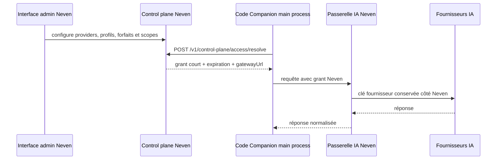

# Control plane Neven — contrat backend

Version 2.8.0.

Cette couche prépare la future interface admin Neven sans donner au client les clés Claude, Gemini, Kimi ou autres. Code Companion conserve uniquement, dans le **main process**, un grant court vers la passerelle Neven.

## Flux cible



## Contrat provisoire

`POST /v1/control-plane/access/resolve`

```json
{
  "workspaceId": "workspace-123",
  "profile": "haiku | luna | sol | opus",
  "capability": "completion"
}
```

Réponse minimale attendue :

```json
{
  "granted": true,
  "gatewayUrl": "https://gateway.neven.example",
  "accessToken": "short-lived-token",
  "expiresAt": "2026-08-09T12:00:00.000Z",
  "scopes": ["completion"]
}
```

Le client Electron refuse un grant sans expiration, sans passerelle valide ou déjà expiré. Le token est gardé en mémoire, jamais écrit dans les settings, jamais envoyé au renderer et jamais journalisé.

`POST /v1/control-plane/access/revoke` reçoit uniquement `workspaceId` et invalide les grants côté Neven.

## Événements d’usage internes

`POST /api/v1/internal/events` reçoit les événements normalisés de Code Companion. L’appel est fait exclusivement dans le main process : le renderer ne reçoit ni ne fournit le jeton d’authentification.

```json
{
  "eventId": "evt_01HXYZ",
  "eventType": "usage.recorded",
  "occurredAt": "2026-08-16T10:00:00.000Z",
  "workspaceId": "workspace-123",
  "usage": {
    "origin": "neven | byok | local",
    "providerId": "anthropic",
    "inputTokens": 120,
    "outputTokens": 80,
    "durationMs": 420,
    "success": true
  }
}
```

`eventId` est obligatoire et est aussi envoyé dans l’en-tête `Idempotency-Key` : le backend peut donc dédupliquer une republication du même événement. Le client borne les identifiants, les compteurs et la durée ; il n’envoie jamais de prompt, réponse, clé, jeton, message d’erreur backend ou champ libre.

L’authentification est un bearer résolu côté backend Electron via `NEVEN_INTERNAL_EVENTS_TOKEN`. Les échecs 401/403, timeout et réseau exposent seulement un résultat générique au consommateur ; aucun détail de transport ou de réponse serveur n’est remonté.

`NEVEN_WORKSPACE_ID` est requis pour publier ces événements. S’il est absent, la télémétrie est désactivée localement sans appel réseau. `NEVEN_CONTROL_PLANE_ALLOWED_HOSTS` doit contenir explicitement chaque hôte distant du control plane **et de la passerelle** (liste séparée par des virgules) ; seuls ces hôtes en HTTPS sont acceptés. Les URLs loopback sont réservées au développement.

Toutes les requêtes sensibles du control plane, y compris l’ingestion d’événements, utilisent `redirect: 'error'`. Une réponse de redirection est donc refusée sans suivre la nouvelle URL : un bearer ne peut pas être transmis à un hôte absent de l’allowlist.

## Exécution managed (COD-26A)

L’exécution gateway est désactivée par défaut et exige `NEVEN_MANAGED_GATEWAY_ENABLED=true` dans le main process. Elle garde un cache mémoire par `(workspaceId, profile, capability)` jusqu’à l’expiration moins une marge de sécurité. Une révocation supprime d’abord toutes les entrées locales du workspace, même si l’appel distant échoue.

La passerelle reçoit uniquement `workspaceId`, `profile`, `capability` et un sous-ensemble de la demande de completion. Le payload ne contient jamais de champ `provider` : le choix du fournisseur et ses clés restent chez Neven. Le grant court est envoyé comme bearer exclusivement depuis le main process et n’est jamais converti en clé d’un adaptateur fournisseur. Si la passerelle indique un grant expiré (401/403), le cache est invalidé, un nouveau grant est demandé et la completion est rejouée une seule fois. Les autres erreurs sont normalisées et suivent la policy BYOK existante : fallback seulement après erreur opérationnelle autorisée, refus/permission sans fallback.

## Migration de configuration

Depuis 2.6.1, une configuration Neven distante exige une allowlist explicite. Ajoutez tous les hôtes attendus, par exemple `NEVEN_CONTROL_PLANE_ALLOWED_HOSTS=api.neven.example,gateway.neven.example`. Une configuration existante avec URL Neven mais sans allowlist ne bloque plus le démarrage : le client Neven reste désactivé et répond `not_configured` jusqu’à la migration. Une URL distante absente de l’allowlist, y compris une `gatewayUrl` reçue dans un grant, est refusée.

Le contrat est derrière des variables d'environnement : l'URL réelle et les routes pourront être remplacées quand l'interface admin sera disponible. Aucun faux endpoint de production n'est activé par défaut.
