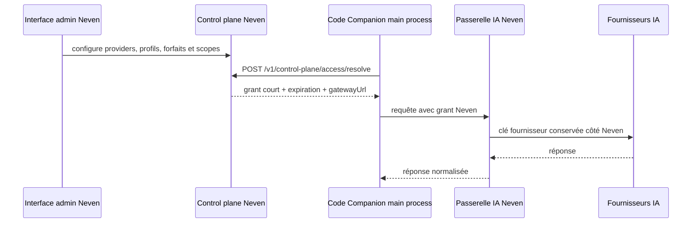

# Control plane Neven — contrat backend

Version 2.2.0.

Cette couche prépare la future interface admin Neven sans donner au client les clés Claude, Gemini, Kimi ou autres. Code Companion conserve uniquement, dans le **main process**, un grant court vers la passerelle Neven.

## Flux cible



## Contrat provisoire

`POST /v1/control-plane/access/resolve`

```json
{
  "workspaceId": "workspace-123",
  "profile": "haiku | luna | sol | opus",
  "capability": "completion"
}
```

Réponse minimale attendue :

```json
{
  "granted": true,
  "gatewayUrl": "https://gateway.neven.example",
  "accessToken": "short-lived-token",
  "expiresAt": "2026-08-09T12:00:00.000Z",
  "scopes": ["completion"]
}
```

Le client Electron refuse un grant sans expiration, sans passerelle valide ou déjà expiré. Le token est gardé en mémoire, jamais écrit dans les settings, jamais envoyé au renderer et jamais journalisé.

`POST /v1/control-plane/access/revoke` reçoit uniquement `workspaceId` et invalide les grants côté Neven.

Les complétions managed passent ensuite par `POST /v1/gateway/completions` avec le grant dans `Authorization: Bearer`. Le main process l'utilise pour chat, inline et ghost; il ne retombe jamais sur un fournisseur direct dans ce mode. La réponse publique est strictement `{ success: true, text }`: clé fournisseur, modèle interne, grant et erreurs amont sont retirés avant l'IPC renderer.

Sans URL/session de control plane, ou quand le grant est refusé, expiré, révoqué, en timeout ou invalide, l'exécution managed échoue fermée. Aucun appel fournisseur ne doit alors être tenté.

Le contrat est derrière des variables d'environnement : l'URL réelle et les routes pourront être remplacées quand l'interface admin sera disponible. Aucun faux endpoint de production n'est activé par défaut.
