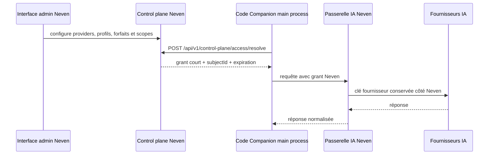

# Control plane Neven — contrat backend

Version 3.1.0 (COD-34).

Cette couche prépare la future interface admin Neven sans donner au client les clés Claude, Gemini, Kimi ou autres. Code Companion conserve uniquement, dans le **main process**, un grant court vers la passerelle Neven.

## Flux cible



## Contrat provisoire

`POST /api/v1/control-plane/access/resolve`

```json
{
  "workspaceId": "123e4567-e89b-42d3-a456-426614174000",
  "deviceId": "223e4567-e89b-42d3-a456-426614174000",
  "profile": "haiku | luna | sol | opus",
  "capability": "completion"
}
```

Réponse minimale attendue :

```json
{
  "data": {
    "grant": "short-lived-grant",
    "subjectId": "423e4567-e89b-42d3-a456-426614174000",
    "expiresAt": "2026-08-09T12:00:00.000Z"
  }
}
```

Le client Electron refuse un grant sans expiration, sans passerelle valide ou déjà expiré. Le token est gardé en mémoire, jamais écrit dans les settings, jamais envoyé au renderer et jamais journalisé.

`POST /api/v1/control-plane/access/revoke` reçoit uniquement `{ "grant": "..." }` et invalide ce grant côté Neven.

## Identité workspace et session (COD-31)

Le chemin local ouvert par l'utilisateur reste réservé aux opérations de fichiers : il n'est jamais utilisé comme identifiant réseau. Le main process lit `NEVEN_WORKSPACE_ID`, qui doit être un UUID strict, et refuse le contexte Neven en cas de valeur absente, invalide ou sans répertoire `userData` disponible. Chaque fenêtre/sender reçoit un contexte main-process isolé limité à `workspaceId` et à un `deviceId` stable ; ni le renderer ni ses payloads IPC ne peuvent choisir un workspace, un device, un token ou un grant.

`deviceId` est validé comme UUID strict et transmis au resolve depuis le main process. Il participe au cache `(workspaceId, deviceId, profile, capability)` et ne traverse jamais l’IPC renderer. Le revoke reste limité au grant conformément au contrat. Les grants restent mémoire-only.

Le `deviceId` et le token de session d'enrôlement sont stockés par le main process dans le répertoire `userData`, chiffrés avec `electron.safeStorage` lorsqu'il est disponible. Ils ne sont jamais inclus dans le contexte IPC, les objets renderer ou les logs. Si le chiffrement OS est indisponible, aucune persistance n'est permise en production. Un fallback de session par variable d'environnement est autorisé seulement en développement avec `NEVEN_DEV_SESSION_TOKEN_ENABLED=true` et `NEVEN_DEV_SESSION_TOKEN`; il ne sert jamais en production et ne doit pas être utilisé pour un déploiement. `NEVEN_ACCESS_TOKEN` et `NEVEN_SESSION_TOKEN` ne participent plus à la résolution normale.

## Événements d’usage internes

`POST /api/v1/internal/events` reçoit les événements normalisés de Code Companion. L’appel est fait exclusivement dans le main process : le renderer ne reçoit ni ne fournit le jeton d’authentification.

```json
{
  "eventId": "evt_01HXYZ",
  "eventType": "usage.recorded",
  "occurredAt": "2026-08-16T10:00:00.000Z",
  "workspaceId": "123e4567-e89b-42d3-a456-426614174000",
  "usage": {
    "origin": "neven | byok | local",
    "providerId": "anthropic",
    "inputTokens": 120,
    "outputTokens": 80,
    "durationMs": 420,
    "success": true
  }
}
```

`eventId` est obligatoire et est aussi envoyé dans l’en-tête `Idempotency-Key` : le backend peut donc dédupliquer une republication du même événement. Le client borne les identifiants, les compteurs et la durée ; il n’envoie jamais de prompt, réponse, clé, jeton, message d’erreur backend ou champ libre.

L’authentification est un bearer résolu côté backend Electron via `NEVEN_INTERNAL_EVENTS_TOKEN`. Les échecs 401/403, timeout et réseau exposent seulement un résultat générique au consommateur ; aucun détail de transport ou de réponse serveur n’est remonté.

`NEVEN_WORKSPACE_ID` doit être un UUID configuré côté main process pour publier ces événements. S’il est absent ou invalide, la télémétrie est désactivée localement sans appel réseau. `NEVEN_CONTROL_PLANE_ALLOWED_HOSTS` doit contenir explicitement chaque hôte distant du control plane **et de la passerelle** (liste séparée par des virgules) ; seuls ces hôtes en HTTPS sont acceptés. Les URLs loopback sont réservées au développement.

Toutes les requêtes sensibles du control plane, y compris l’ingestion d’événements, utilisent `redirect: 'error'`. Une réponse de redirection est donc refusée sans suivre la nouvelle URL : un bearer ne peut pas être transmis à un hôte absent de l’allowlist.

## Exécution managed (COD-26A)

L’exécution gateway est désactivée par défaut et exige `NEVEN_MANAGED_GATEWAY_ENABLED=true` dans le main process. La policy locale choisit d’abord `local`, BYOK ou Neven : local/BYOK ne résolvent aucun grant. Le cache mémoire est par `(workspaceId, deviceId, profile, capability)` jusqu’à l’expiration moins une marge de sécurité. Une révocation supprime d’abord les entrées locales du workspace/device, même si l’appel distant échoue.

La gateway est construite à partir de `NEVEN_API_BASE_URL + /api/v1/gateway` et reçoit `POST /api/v1/gateway/completions`. Son JSON plat contient uniquement `workspaceId`, `deviceId`, `subjectId`, `profile`, `capability`, `mode` (`chat`, `inline`, `ghost`) et les champs de prompt bornés. Provider, modèle et clés sont exclus du payload : le choix du fournisseur et ses clés restent chez Neven. Le grant court est envoyé comme bearer exclusivement depuis le main process et n’est jamais converti en clé d’un adaptateur fournisseur. La réponse est déballée depuis `data`. Si la passerelle indique `grant_expired`, le cache est invalidé, un nouveau grant est demandé et la completion est rejouée une seule fois sans remonter de détail de transport.

## Migration de configuration

Depuis 2.6.1, une configuration Neven distante exige une allowlist explicite. Ajoutez tous les hôtes attendus, par exemple `NEVEN_CONTROL_PLANE_ALLOWED_HOSTS=api.neven.example,gateway.neven.example`. Une configuration existante avec URL Neven mais sans allowlist ne bloque plus le démarrage : le client Neven reste désactivé et répond `not_configured` jusqu’à la migration. Une URL distante absente de l’allowlist, y compris une `gatewayUrl` reçue dans un grant, est refusée.

Le contrat est derrière des variables d'environnement : l'URL réelle et les routes pourront être remplacées quand l'interface admin sera disponible. Aucun faux endpoint de production n'est activé par défaut.
