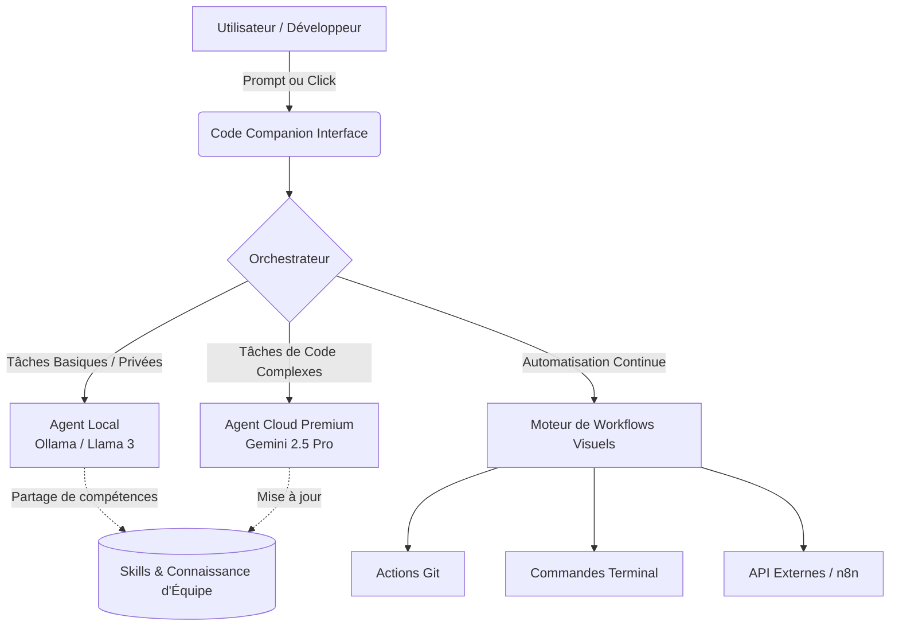
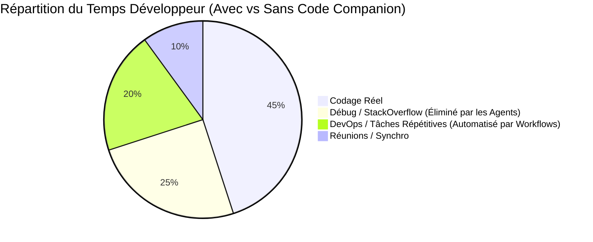

# Pitch Deck : Code Companion

Ce document est formaté comme une présentation interactive. Utilisez un lecteur Markdown compatible (ou convertissez-le en PDF/PPT via des outils comme Marp) pour le projeter à vos clients.

````carousel
# 🚀 Code Companion
## L'IDE qui ne se contente pas de coder, il exécute.
**La première plateforme hybride réunissant un Éditeur de Code IA, des Agents Autonomes et des Workflows Visuels.**

*Présenté par : [Votre Nom / Entreprise]*
<!-- slide -->
## ❌ Le Problème du Marché Actuel

Les développeurs et les entreprises perdent un temps infini à jongler entre des outils déconnectés.

* **Les IDE classiques** (VS Code, IntelliJ) sont passifs : ils attendent que l'humain tape.
* **Les IDE IA de 1ère génération** (Cursor, Copilot) sont des "copilotes" : ils génèrent du texte, mais n'exécutent pas de processus métiers complexes seuls.
* **Les outils d'automatisation** (n8n, Zapier) sont excellents pour les workflows, mais sont déconnectés du code source du projet.

**Résultat :** Une charge mentale énorme et des coûts d'intégration prohibitifs pour les entreprises.
<!-- slide -->
## ✅ La Révolution : Code Companion

Une fusion inédite entre un Environnement de Développement et une plateforme d'Automatisation Multi-Agents.

1. **🤖 Agents Autonomes** : Des terminaux intelligents qui lisent vos erreurs, réfléchissent, et se corrigent d'eux-mêmes (ReAct loop).
2. **🧩 Workflows Visuels "No-Code"** : Créez des chaînes d'automatisation (CI/CD, Analyse, Déploiement) par simple glisser-déposer sans quitter votre code.
3. **🌐 Hybride & Local-First** : Confidentialité totale. Le code sensible est traité localement (Ollama), la stratégie est pilotée par le Cloud (Gemini/Claude).
<!-- slide -->
## 📊 Comparaison avec la Concurrence

Où se situe Code Companion par rapport aux géants du marché ?

| Fonctionnalité | VS Code | Cursor | Devin (AutoGPT) | **Code Companion** |
| :--- | :---: | :---: | :---: | :---: |
| Éditeur de code natif | ✅ | ✅ | ❌ | **✅** |
| Auto-complétion IA | ❌ | ✅ | ✅ | **✅** |
| Terminaux IA Autonomes | ❌ | ❌ | ✅ | **✅** |
| Éditeur de Workflows Drag&Drop | ❌ | ❌ | ❌ | **✅** |
| Catalogue n8n inclus (2000+ flux) | ❌ | ❌ | ❌ | **✅** |
| Confidentialité "Local-First" | ✅ | ❌ | ❌ | **✅** |

> Code Companion est le seul outil à offrir une interface visuelle pour orchestrer des agents IA directement sur le code source de l'entreprise.
<!-- slide -->
## ⚙️ Comment ça marche ? (L'Architecture Hybride)



*Une architecture conçue pour la résilience, la rapidité et la protection des données (Privacy By Design).*
<!-- slide -->
## 📈 Projections & ROI pour vos équipes

Pourquoi investir dans des licences `Code Companion` pour vos développeurs ou chefs de projet ?



**💰 Le ROI chiffré (Pour une équipe de 5 devs) :**
- **Gain de temps** : ~15h/semaine par développeur (grâce aux terminaux autonomes qui corrigent les bugs seuls et aux workflows CI/CD visuels).
- **Économie annuelle estimée** : +60 000 € (Moins d'outils tiers SaaS à payer : Zapier + Cursor + GitHub Copilot fusionnés en 1 seule licence).
- **Temps de déploiement** : Divisé par 3.
<!-- slide -->
## 💎 L'Expérience "SaaS Clé en Main"

Ne vous souciez plus de l'infrastructure. Nous hébergeons les cerveaux.

* 🚀 **Zéro Installation Complexe** : Pas de serveurs Ollama à maintenir, pas de clés OpenAI à gérer par collaborateur.
* 🔐 **SSO Enterprise & Sécurité** : Connectez vos équipes avec Google Workspace / Azure AD. 
* 🌍 **Modèles de pointe pré-inclus** : Accès transparent aux derniers modèles Mistral, Llama, Gemini et Claude 3.5.
* 📦 **Catalogue de 2000+ Workflows** : Des intégrations (Jira, Slack, Salesforce, GitHub) prêtes en un clic via notre adaptateur communautaire n8n.
<!-- slide -->
## 🛒 Notre Offre Commerciale B2B

Choisissez le plan adapté à la taille de votre ambition.

| Piliers | "Pro" | "Entreprise" |
| :--- | :--- | :--- |
| **Cible** | Freelances, Agences, Startups | Grands Comptes, ESN |
| **Hébergement IA** | Hébergé dans notre Cloud Sécurisé | Dédié (Single-Tenant) ou On-Premise (VPC) |
| **Confidentialité** | Standard (Zero Data Retention) | Avancée (Local-First Ollama Exclusif possible) |
| **Workflows Visuels**| Actifs illimités | Actifs illimités + Bibliothèque partagée d'équipe |
| **Prix** | **29€** /mois /utilisateur | **49€** /mois /utilisateur |

🚀 **Prêt à transformer votre façon de développer ?**
👉 Contactez-nous pour une démo en direct : *contact@codecompanion.com*
````
